# Executive summary

Real-estate Data Analysis is a data preprocessing and analysis project aimed at preparing and understanding real estate data for further usage, such as predictive modeling and decision-making. The project focuses on cleaning, transforming, and analyzing the dataset to derive meaningful insights.

**Key Features**

- *Data Cleaning*: The project involves the removal of unnecessary columns, handling missing values, and fixing data inconsistencies to ensure the data is reliable for analysis.

- *Data Transformation*: This step includes normalizing and scaling the dataset to ensure all variables are on the same scale for better comparison and analysis.

- *Feature Engineering*: The project highlights the creation of new features from existing data to enhance the dataset and improve the predictive capabilities of potential machine learning models.

- *Exploratory Data Analysis (EDA)*: The project provides an in-depth analysis of the dataset, uncovering trends, patterns, and relationships between variables, which can help make informed decisions in the real estate market.


In conclusion, the Real-estate-data-preprocessing project provides a comprehensive framework for data preprocessing and analyzing real estate data, setting the foundation for future predictive models and decision-making in the real estate industry.


---

## Table of contents

- [Overview](#overview)
- [Data Files](#data-files)
- [Python Libraries](libraries)
- [Data Exploration](#data-exploration)
- [Data Cleanup](#data-cleanup)
- [Fill Missing Values](#fill-missing-values)
- [Data Manipulation](#data-manipulation)
- [Save File](#save-file)
- [Training & Testing columns](#training-&-testing-column-selection)
- [Split Data](#split-data-for-training-&-testing)
- [Fit & Predict using ML model(s)](#fit-&-predict-using-ml-model(s))
- [Bonus](#conformal-prediction)

---

### Overview
[(Back to top)](#table-of-contents)


This real estate data preprocessing project aims to develop a clean, reliable, and comprehensive dataset for the purpose of further analysis and modeling. By conducting data exploration, cleanup, and filling in missing values using machine learning, we will create a solid foundation for future research, enabling more informed decision-making and insight generation.

Also included, is a WIP section for Conformal prediction. A function `conformal_prediction`, is initiated to score the accuracy of the top ML model.

---

### Data Files
[(Back to top)](#table-of-contents)


Original data [file](https://drive.google.com/file/d/1ckj3ofIrAqxJS1wx9PNWnTBd1GJIxRV6/view?usp=share_link) transformed ➡️ to the final cleaned-up [file](https://drive.google.com/file/d/1qvusfqukCXLLppfAsH_xaFXE9cyWkZuY/view?usp=share_link)

---

### Python Libraries
[(Back to top)](#table-of-contents)


```python
# Import required libraries
import pandas as pd
import numpy as np

############### Import warnings + watermark ###############
from watermark import watermark
from warnings import filterwarnings
filterwarnings("ignore")
print(watermark())
print(watermark(iversions=True, globals_=globals()))
```


#### Output:

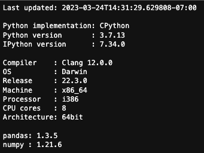

---

### Data Exploration
[(Back to top)](#table-of-contents)


- Download datafile from the link above
- Read csv data file via pandas `read_csv` function
- Display head & tail values of the dataframe
- Convert `price` column values to 2 decimal places
- Get dataframe `.info()`
- Get dataframe `.shape` - (#rows, #columns)
- Find unique values for `status` columns 

```python
# Create pandas dataframe using pandas `read_csv`
data_df = pd.read_csv("original_data.csv")
```

```python
# Display head values
display(data_df.head(5))
```

```python
# Display head values
display(data_df.tail(5))
```


#### Output:

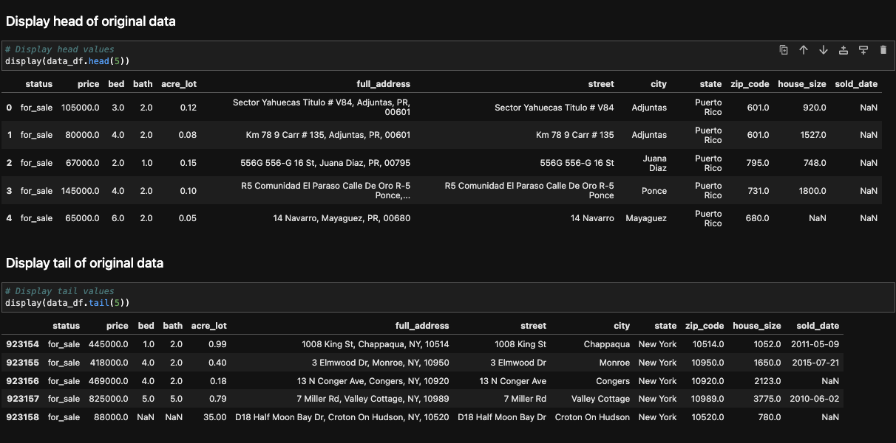


#### Convert `price` to 2 decimal places

```python
# Round `price` to 2 decimals
data_df["price"] = data_df["price"].round(2)
```

#### Get dataframe info

```python
# Get original dataframe info
data_df.info()
```


#### Output:

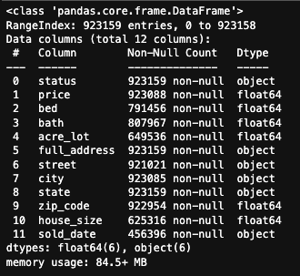


#### Get dataframe shape

```python
# Get original dataframe info
data_df.shape
```


#### Output:

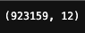


#### Display `status` values for available properties


```python
# Display unique `status` values -  Rows with all values present are: `status`, `price`, `full_address`, `state`
data_df["status"].unique()
```

#### Output:

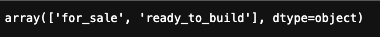


#### Drop `ready_to_build` status value from analysis. Only keep `for_sale` status values.

```python
# Drop all rows with `status = ready_to_build`
data_df = data_df[data_df["status"] != "ready_to_build"]

# Display unique `status` values
data_df["status"].unique()
```


#### Count number of `NaN` values for each column for `for_sale` status


```python
# Count the NaN values in each column
nan_counts = data_df.isna().sum()

# Print the NaN counts for each column
display(nan_counts)
```

#### Output:

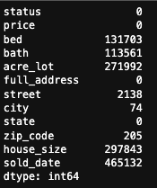


#### Display `for_sale` properties in all available locations

```python
# Find all properties available in each state
display(data_df.groupby("state")["status"].size())
```

#### Output:

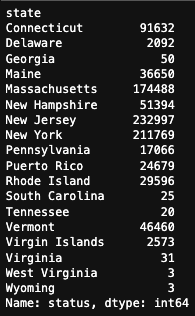

---


### Data Cleanup
[(Back to top)](#table-of-contents)


#### Drop specific locations for analysis - U.S. territories, U.S mainland states with lower than 100 counts available

```python
# Drop Puerto Rico & US Virgin Islands, states with low counts
states_to_drop = ["Virgin Islands", "Puerto Rico", "Georgia", "South Carolina", "Tennessee", "Virginia", "West Virginia", "Wyoming"]
filtered_df = data_df[~data_df["state"].isin(states_to_drop)]


# Display dataframe
display(filtered_df)

# Drop states that have 100 and less properties available
state_counts = filtered_df.groupby("state")["status"].size()
state_counts = state_counts[state_counts >= 100]
selected_states = state_counts.index.tolist()
selected_df = filtered_df[filtered_df["state"].isin(selected_states)]

# Display dataframe
display(selected_df)

# Display unique states with available property count
display(state_counts)
```

#### Output:

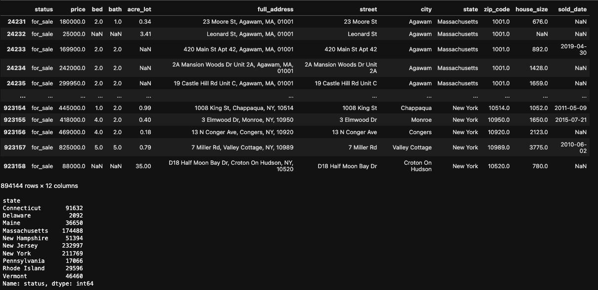


#### Find number of `rows` & `columns` for the states selected dataframe

```python
# Get data shape to get number of rows and columns
selected_df.shape
```

#### Output:


#### List data for all available states in alphabetical order for data analysis

```python
# Sort values by alphabetical state order
sorted_state_df = selected_df.sort_values("state", ascending=True)

display(sorted_state_df.head(5))
print("-------------------------------------------------------------------------------------------------")
display(sorted_state_df.tail(5))
```

#### Output:

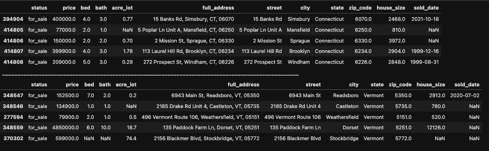


#### List all unique mainland states for analysis

```python
# Display filtered states & datatypes by count
unique_states = sorted_state_df["state"].unique()
display(unique_states)
```

#### Output:

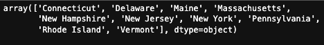


#### Show counts of NaN values

```python
# Count the NaN values in each column
nan_counts = sorted_state_df.isna().sum()

# Print the NaN counts for each column
display(nan_counts)
```

#### Output:


---


### Fill Missing Values
[(Back to top)](#table-of-contents)


#### Fill missing `zip_code` values

```python
# Import KNNImputer function from the sklearn python package
from sklearn.impute import KNNImputer

# Create a KNN imputer object with k=5 and 'uniform' weighting
imputer = KNNImputer(n_neighbors=5, weights='uniform')

# Only select the 'zip_code' column with missing values
zip_df = sorted_state_df[['zip_code']]

# Impute missing 'zip_code' values using KNN imputation
zip_imputed = imputer.fit_transform(zip_df)

# Replace the original 'zip_code' column with the imputed values
sorted_state_df['zip_code'] = zip_imputed
```

```python
# Count the NaN values in each column
nan_counts = sorted_state_df.isna().sum()

# Print the NaN counts for each column
display(nan_counts)
```

#### Output:


#### Fill missing `city` values using `zip_code`

```python
# Group by zip_code and calculate mode of city for each group
mode_by_zip = sorted_state_df.groupby('zip_code')['city'].apply(lambda x: x.mode()[0])

# Create a boolean mask to identify the rows with missing city values
missing_city_mask = sorted_state_df['city'].isna()

# Fill in missing city values with corresponding mode for their zip_code
sorted_state_df.loc[missing_city_mask, 'city'] = sorted_state_df.loc[missing_city_mask, 'zip_code'].map(mode_by_zip)
```

```python
# Count the NaN values in each column
nan_counts = sorted_state_df.isna().sum()

# Print the NaN counts for each column
display(nan_counts)
```

#### Output:

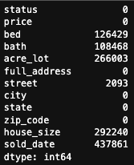


#### Fill missing `house_size` using `zip_code` & `price` as features for the Regression model

```python
from sklearn.linear_model import LinearRegression

# Split the data into two sets: one with complete data for house_size and another with missing values
complete_data = sorted_state_df.dropna(subset=['house_size'])
missing_data = sorted_state_df.loc[sorted_state_df['house_size'].isna()]

# Define the features to be used in the regression model
features = ['zip_code', 'price']

# Fit the linear regression model using the complete data
reg = LinearRegression().fit(complete_data[features], complete_data['house_size'])

# Predict the missing house_size values using the fitted regression model
missing_data['house_size'] = reg.predict(missing_data[features])

# Replace the missing house_size values with the predicted values
sorted_state_df.loc[sorted_state_df['house_size'].isna(), 'house_size'] = missing_data['house_size']
```

```python
# Count the NaN values in each column
nan_counts = sorted_state_df.isna().sum()

# Print the NaN counts for each column
display(nan_counts)
```

#### Output:

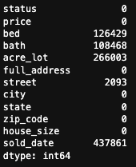


#### Fill missing `acre_lot` using `zip_code`, `price` & `house_size` as features for the Regression model

```python
# Split the data into two sets: one with complete data for house_size and another with missing values
complete_data = sorted_state_df.dropna(subset=['acre_lot'])
missing_data = sorted_state_df.loc[sorted_state_df['acre_lot'].isna()]

# Define the features to be used in the regression model
features = ['zip_code', 'price', 'house_size']

# Fit the linear regression model using the complete data
reg = LinearRegression().fit(complete_data[features], complete_data['acre_lot'])

# Predict the missing house_size values using the fitted regression model
missing_data['acre_lot'] = reg.predict(missing_data[features])

# Replace the missing house_size values with the predicted values
sorted_state_df.loc[sorted_state_df['acre_lot'].isna(), 'acre_lot'] = missing_data['acre_lot']
```

```python
# Count the NaN values in each column
nan_counts = sorted_state_df.isna().sum()

# Print the NaN counts for each column
display(nan_counts)
```


#### Output:

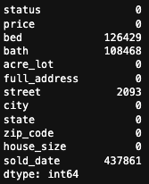


#### Fill missing `bed` using `zip_code`, `price`, `house_size` & `acre_lot` as features for the Regression model

```python
# Split the data into two sets: one with complete data for house_size and another with missing values
complete_data = sorted_state_df.dropna(subset=['bed'])
missing_data = sorted_state_df.loc[sorted_state_df['bed'].isna()]

# Define the features to be used in the regression model
features = ['zip_code', 'price', 'house_size', 'acre_lot']

# Fit the linear regression model using the complete data
reg = LinearRegression().fit(complete_data[features], complete_data['bed'])

# Predict the missing house_size values using the fitted regression model
missing_data['bed'] = reg.predict(missing_data[features])

# Replace the missing house_size values with the predicted values
sorted_state_df.loc[sorted_state_df['bed'].isna(), 'bed'] = missing_data['bed']
```

```python
# Count the NaN values in each column
nan_counts = sorted_state_df.isna().sum()

# Print the NaN counts for each column
display(nan_counts)
```

#### Output:

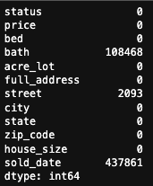


#### Fill missing `bath` using `zip_code`, `price`, `house_size`, `acre_lot` & `bed` as features for the Regression model

```python
# Split the data into two sets: one with complete data for house_size and another with missing values
complete_data = sorted_state_df.dropna(subset=['bath'])
missing_data = sorted_state_df.loc[sorted_state_df['bath'].isna()]

# Define the features to be used in the regression model
features = ['zip_code', 'price', 'house_size', 'acre_lot', 'bed']

# Fit the linear regression model using the complete data
reg = LinearRegression().fit(complete_data[features], complete_data['bath'])

# Predict the missing house_size values using the fitted regression model
missing_data['bath'] = reg.predict(missing_data[features])

# Replace the missing house_size values with the predicted values
sorted_state_df.loc[sorted_state_df['bath'].isna(), 'bath'] = missing_data['bath']
```

```python
# Count the NaN values in each column
nan_counts = sorted_state_df.isna().sum()

# Print the NaN counts for each column
display(nan_counts)
```


#### Output:

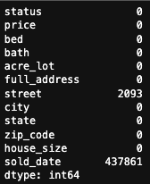


#### Fill missing `street` values by extracting values from `full_address`

```python
def extract_street_name(address):
    # Split the address by commas and take the first element
    street_address = address.split(',')[0].strip()
    # Split the street address by spaces and take the last two elements
    street_name = ' '.join(street_address.split()[-2:])
    return street_name

# Apply the function to fill in missing street names
sorted_state_df['street'] = sorted_state_df['street'].fillna(sorted_state_df['full_address'].apply(extract_street_name))
```

```python
# Count the NaN values in each column
nan_counts = sorted_state_df.isna().sum()

# Print the NaN counts for each column
display(nan_counts)
```


#### Output:

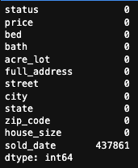


---


### Data manipulation
[(Back to top)](#table-of-contents)


#### Round `bed` values to `integer`

```python
# Round bed column to the nearest .0 value on the sorted dataframe
sorted_state_df['bed'] = np.rint(sorted_state_df['bed'])
```


#### Round `bath` values to nearest .0 or .5 value

```python
# Round `bath` column to the nearest .0 or .5 value
sorted_state_df['bath'] = sorted_state_df['bath'].apply(lambda x: round(x * 2) / 2)
```


#### Convert `acre_lot` to 2 decimal places

```python
# # Convert acre_lot column to 2 decimal places on the dataframe
sorted_state_df['acre_lot'] = sorted_state_df['acre_lot'].round(2)

# Replace negative acre_lot values with "Unavailable" on the dataframe
sorted_state_df['acre_lot'] = sorted_state_df['acre_lot'].apply(lambda x: "Unavailable" if x < 0 else round(x, 2))

# Convert house_size column to 1 decimal places on the dataframe
sorted_state_df['house_size'] = sorted_state_df['house_size'].round(1)
```


#### Convert `zip_code` values to show appropirate 5-digit zipcodes & Convert zip_code to string and pad with leading zeros

```python
sorted_state_df['zip_code'] = sorted_state_df['zip_code'].astype(int).astype(str).apply(lambda x: x.zfill(5))
```

#### Display info on the new dataframe

```python
# Display info
display(sorted_state_df.info())
```

#### Output:

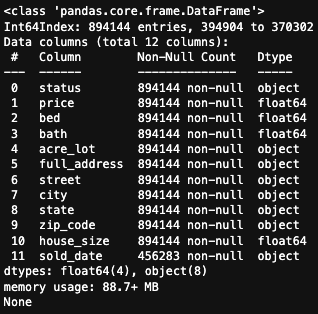


#### Convert all negative `acre_lot` values to 'Unavailable'

```python
# Count rows where acre_lot is "Unavailable"
unavailable_count = (sorted_state_df['acre_lot'] == 'Unavailable').sum()

# Print the count
print(f"There are {unavailable_count} rows where `acre_lot` is 'Unavailable'.")
```


#### Output:

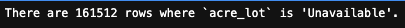


#### Convert all missing `sold_date` values to 'Unavailable'

```python
# Replace missing sold_date values with "Unavailable"
sorted_state_df["sold_date"].fillna("Unavailable", inplace=True)

# Count the number of "Unavailable" sold_date values
unavailable_count = (sorted_state_df["sold_date"] == "Unavailable").sum()

# Print the count of "Unavailable" sold_date values
print(f"There are {unavailable_count} rows where `sold_date` is 'Unavailable'.")
```


#### Output:

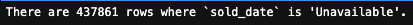


#### Display all NaN counts

```python
# Count the NaN values in each column again
nan_counts = sorted_state_df.isna().sum()

# Print the NaN counts for each column
display(nan_counts)
```


#### Output:

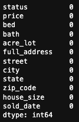


#### Add a new column to `price_sq_ft` that shows a ratio of `price` / `house_size`

```python
sorted_state_df['price_sq_ft'] = (sorted_state_df['price'] / sorted_state_df['house_size']).round(2)
```

#### Use `bed` and `bath` equals to 1 as starting point

```python
sorted_state_df = sorted_state_df.loc[(sorted_state_df['bed'] >= 1) & (sorted_state_df['bath'] >= 1)]
```

#### Drop `status` column as everything is `for_sale`

```python
sorted_state_df = sorted_state_df.drop('status', axis=1)
display(sorted_state_df.dtypes)
```

#### Get final dataframe shape

```python
# Get final dataframe shape
display(sorted_state_df.shape)
```


#### Output:

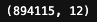


---


### Save file
[(Back to top)](#table-of-contents)


```python
sorted_state_df.to_csv('sorted_state_df.csv', index=False)
```


---


### Training & Testing column selection
[(Back to top)](#table-of-contents)


#### Create `X` & `y` columns for further training & testing

```python
# Select columns for X and y for training & testing
X = sorted_state_df[['bed', 'bath', 'house_size', 'price_sq_ft']]
print(X.dtypes)
y = sorted_state_df['price']
print(y.dtypes)
```

```python
display(X.head())
print("----------------------------------------")
display(y.head())
```


#### Output:

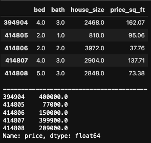


---


### Split data for training & testing
[(Back to top)](#table-of-contents)


```python
# Import sklearn train_test_split library
from sklearn.model_selection import train_test_split

# Define params - use 20% as test data, and set random_state = 10
X_train, X_test, y_train, y_test = train_test_split(X, y, test_size=0.2, random_state=10)
```

---


### Fit & Predict using ML model(s)
[(Back to top)](#table-of-contents)


- Pick 5 regression models: `XGBoost`, `Linear Regression`, `Decision Tree`, `Random Forest`, and `Gradient Boosting`.

- Pick scoring metrics: `Root Mean Square Error (RMSE)`, `R^2`, `Mean Absolute Error (MAE)`

```python
# Import necessary libraries
from sklearn.metrics import mean_squared_error, r2_score, mean_absolute_error
from xgboost import XGBRegressor
from sklearn.linear_model import LinearRegression
from sklearn.tree import DecisionTreeRegressor
from sklearn.ensemble import RandomForestRegressor, GradientBoostingRegressor

# Define the regressor models to use
models = [
    ('XGBoost', XGBRegressor()),  # XGBoost regressor
    ('Linear Regression', LinearRegression()),  # Linear regression model
    ('Decision Tree', DecisionTreeRegressor()),  # Decision tree regressor
    ('Random Forest', RandomForestRegressor()),  # Random forest regressor
    ('Gradient Boosting', GradientBoostingRegressor())  # Gradient boosting regressor
]

# Evaluate the models using cross-validation and print the results
for name, model in models:
    # Fit the model to the training data
    model.fit(X_train, y_train)

    # Make predictions on the test data
    y_pred = model.predict(X_test)

    # Compute the evaluation metrics on the test data
    rmse = mean_squared_error(y_test, y_pred, squared=False)
    r2 = r2_score(y_test, y_pred)
    mae = mean_absolute_error(y_test, y_pred)

    # Print the evaluation metrics for the model
    print(f"Model: {name}")
    print(f"  RMSE on test data: {rmse:.2f}")  # root mean squared error
    print(f"  R^2 on test data: {r2:.2f}")  # R-squared score
    print(f"  MAE on test data: {mae:.2f}")  # mean absolute error
    print("------")

# Find the winning model with the best evaluation metric
winning_model, winning_metric = min([(name, model) for name, model in models], key=lambda x: mean_squared_error(y_test, x[1].predict(X_test), squared=False))

# Compute the evaluation metrics for the winning model
y_pred = winning_metric.predict(X_test)
rmse = mean_squared_error(y_test, y_pred, squared=False)
r2 = r2_score(y_test, y_pred)
mae = mean_absolute_error(y_test, y_pred)

# Sort models by RMSE score in ascending order
sorted_models = sorted(models, key=lambda x: mean_squared_error(y_test, x[1].predict(X_test), squared=False))

# Display the winning model
print(f"The winning model is {winning_model} with the lowest RMSE score of {rmse:.2f} on the test data, indicating the best performance.")
print(f"The R^2 score of the winning model is {r2:.2f}, and the MAE score is {mae:.2f}.\n")

# Display the second best model
second_best_model = sorted_models[1][1]
y_pred = second_best_model.predict(X_test)
rmse = mean_squared_error(y_test, y_pred, squared=False)
r2 = r2_score(y_test, y_pred)
mae = mean_absolute_error(y_test, y_pred)
print(f"The second best model is {sorted_models[1][0]} with an RMSE score of {rmse:.2f} on the test data.")
print(f"The R^2 score of the second best model is {r2:.2f}, and the MAE score is {mae:.2f}.")
```


#### Output:

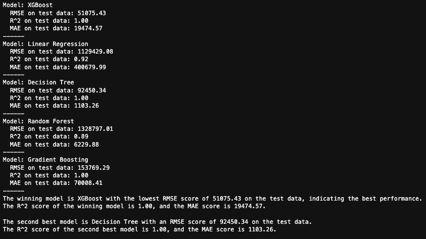


---


### Conformal prediction
[(Back to top)](#table-of-contents)


- Define a function to calculate the prediction intervals using the conformal prediction algorithm - `XGBoost`

```python
def conformal_prediction(model, X_train, y_train, X_test, significance_level):
    n_train = X_train.shape[0]
    n_test = X_test.shape[0]
    n_features = X_train.shape[1]
    alpha = significance_level / n_train

    # Fit the model on the training data
    model.fit(X_train, y_train)

    # Get the predicted values and residuals for the training data
    y_pred_train = model.predict(X_train)
    residuals_train = y_train - y_pred_train

    # Calculate the prediction intervals for the test data
    y_pred_test = model.predict(X_test)
    residuals_test = y_train - y_pred_test
    intervals = np.zeros((n_test, 2))
    for i in range(n_test):
        x_i = X_test[i, :]
        y_i = y_pred_test[i]
        r_i = residuals_test[i]
        sigma_i = np.sqrt(np.sum((residuals_train - r_i) ** 2) / (n_train - n_features - 1))
        quantile = np.quantile(np.abs(residuals_train - r_i) / sigma_i, 1 - alpha)
        interval = (y_i - quantile * sigma_i, y_i + quantile * sigma_i)
        intervals[i, :] = interval

    return intervals
```

---